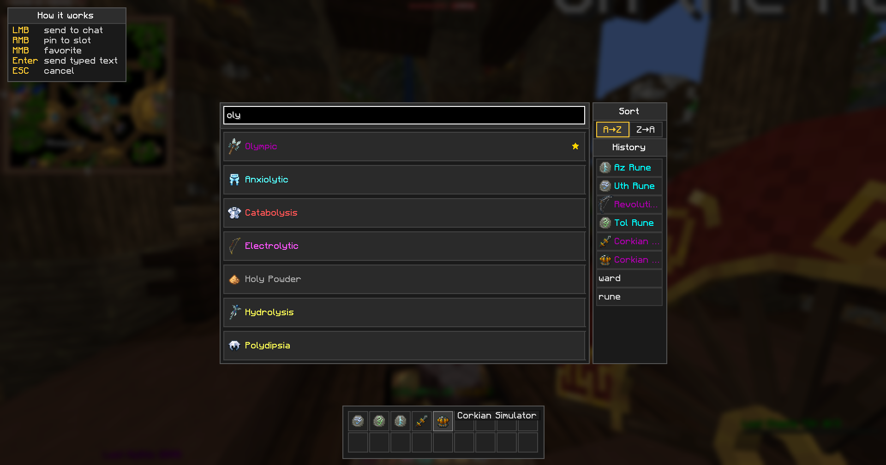

# WynnMarketSearch

A Fabric mod that replaces Wynncraft's market chat search with a fast searchable GUI.

[Русский](README.ru.md)



## What it does

When the market asks `Type the item name or type 'cancel' to cancel:`, the mod
opens a search panel instead. Items load from a self-hosted backend that
refreshes the Wynncraft database daily, so no API key is shipped to clients.

## Controls

| Action | Effect |
|---|---|
| **LMB** on item | send name to chat |
| **RMB** on item | pin to bottom slot |
| **MMB** on item | toggle favorite (★ marker, floats to top) |
| **LMB** on slot / history row | re-send to chat |
| **RMB** on slot / history row | remove |
| **Enter** | send typed text as-is |
| **ESC** | cancel |

The right side panel sorts results A→Z / Z→A; the bottom strip holds up to 18
pinned items, and history keeps the last 20 sent queries.

## Install

1. Fabric Loader for **Minecraft 1.21.11**
2. Drop the `.jar` plus dependencies into `mods/`:
   - [Fabric API](https://modrinth.com/mod/fabric-api)
   - [Cloth Config](https://modrinth.com/mod/cloth-config)
   - [Mod Menu](https://modrinth.com/mod/modmenu) (optional, exposes the settings)

## Settings (Mod Menu → WynnMarketSearch)

| Option | What |
|---|---|
| Enable Market Search | open GUI on the chat trigger |
| Auto-focus Search Box | focus the input on open |
| Item Database API URL | override to self-host |
| Show History Panel | toggle history list |
| Show Pinned Slots | toggle bottom strip |
| Show Instructions Box | toggle the help corner |

## Commands

- `/wms` — open the GUI manually
- `/wms add <name>` — add a personal custom item
- `/wms del <name>` — remove one
- `/wms list` — list personal customs
- `/wms reload` — force a fresh fetch from the backend (bypasses local cache)

## Build

```bash
./gradlew build       # → build/libs/wms-*.jar
./gradlew runClient   # dev client
```

## License

[CC0 1.0](LICENSE) — Public Domain.

## Links

- [Source](https://github.com/a0gzy/WynnMarketSearch)
- [Issues](https://github.com/a0gzy/WynnMarketSearch/issues)
